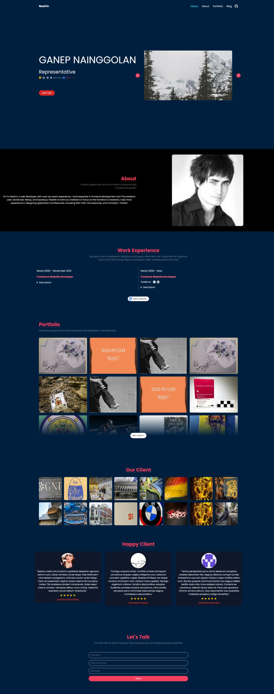

👋 Halo Dunia! Saya Ahmad Nasirin, seorang pengembang bersemangat yang mencintai kode dan teknologi. Saat ini, saya sedang menjelajahi dunia pengembangan perangkat lunak dan senang berkontribusi pada proyek-proyek open source.

🚀 Pengalaman Saya: 
🌐 Pengembang perangkat lunak dengan fokus pada web developer dengan tampilan yang menarik dan reaktif. 
💼 PT golektruk dot com - Frontend developer 

🌱 Saat Ini Saya Sedang Belajar: 
📚 belajar hal yang baru adalah kegiatan yang menyenangkan, saat ini saya sedang belajar artificial intelegent untuk kebutuhan bisnis dan perusahaan.

👨‍💻 Bahasa Pemrograman Favorit Saya: 
💻 javascript  
💻 php  
💻 python (comming soon) 

🛠️ Alat dan Teknologi yang Sering Saya Gunakan: 
🧰 nextjs  
🧰 laravel  
🧰 expressjs  
🧰 tailwindcss  
🧰 MySQL  
🧰 Microservice  

📫 Cara Menghubungi Saya: 
📧 Email: kangsunatdev@gmail.com 
💼 LinkedIn: https://www.linkedin.com/in/ahmad-nasirin-b8720711a/ 
💬 Jangan ragu untuk berbicara tentang pemrograman, teknologi, atau hal lainnya! Saya selalu terbuka untuk kolaborasi dan berbagi pengetahuan. Mari bersama-sama membuat dunia ini lebih baik dengan kode!

Happy coding! 👨‍💻✨

